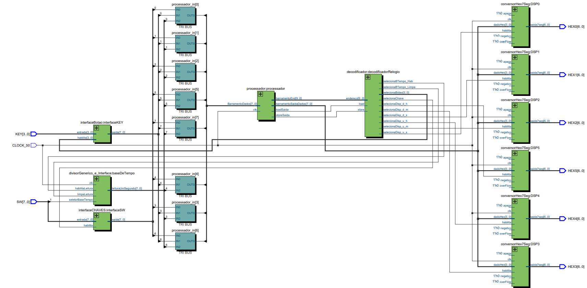

# Projeto 1 - Design de Computadores
## Manuela Castilla, Thiago Verardo e Vitor Calcete.

### Objetivo:
O objetivo do projeto é a implementação de um processador, que será utilizado em uma relógio com as seguintes características (projeto mínimo):

- [x] Indica horas, minutos e segundos
 (O horário é mostrado através do display de sete segmentos.)

- [x] Possui algum sistema para acertar o horário
 (Com switches e botões)

- [x] Possui seleção da base de tempo
 (Para mostrar a passagem das 24 horas em tempo reduzido)
 
 ### Opcionais:

- [x] Assembler em Python

### Diagrama:

  

### Funcionamento:

#### Switches:
Dois switches tem funções:

<ul>
  <li>SW 0: Se 1, ao clicar nos botões configura a hora, minuto e segundo.</li>
  <li>SW 1: Se 0 = usa a base de tempo de 1 segundo; Se 1 = usa A base de tempo mais rápida;</li>
</ul>

#### Botões:

Quando o SW 0 está ligado:

<ul>
  <li>But 0: incrementa dezena dos segundos;</li>
  <li>But 1: incrementa unidade dos minutos;</li>
  <li>But 2: incrementa dezena dos minutos;</li>
  <li>But 3: incrementa unidade das horas;</li>
</ul>
